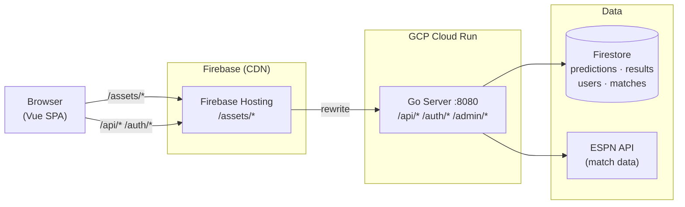
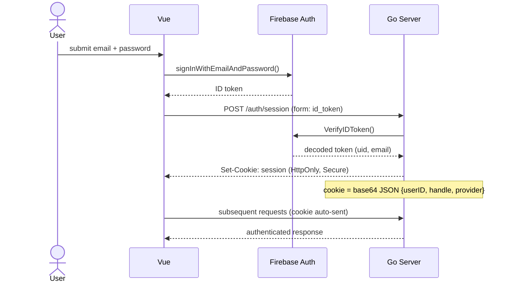
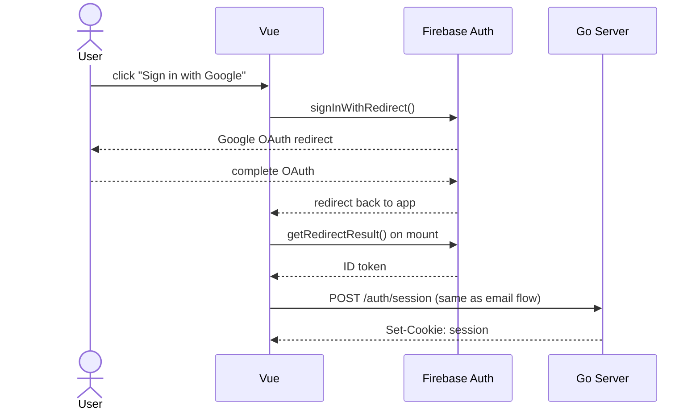
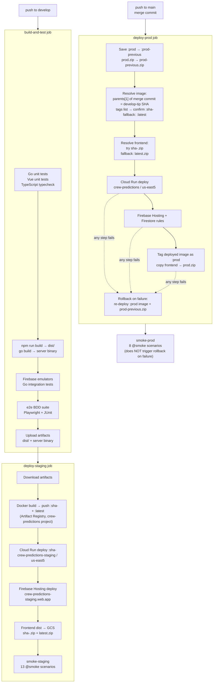
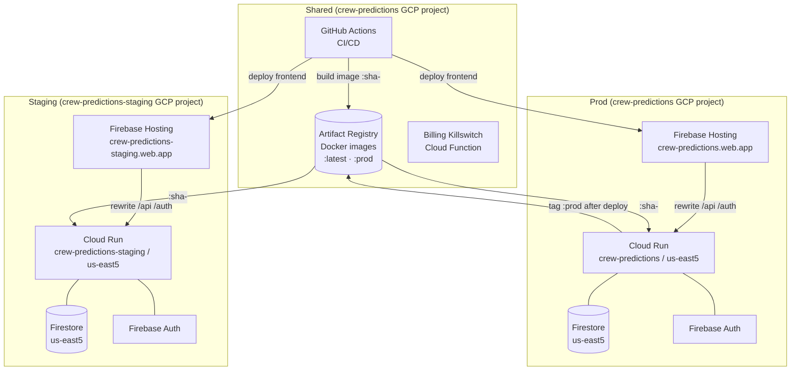

# Architecture

## Stack

| Layer | Technology | Why |
|---|---|---|
| Language | Go | Fast cold starts, single binary, good GCP SDKs |
| Compute | GCP Cloud Run | Multi-route web app, free tier (2M req/mo) |
| Frontend | Vue 3 + TypeScript + Vite | Simpler than React, user preference over templ/HTMX |
| Database | Firestore | GCP always-free (50k reads/20k writes per day) |
| Auth | Firebase Auth — Email/Password + Google SSO | Custom form; FirebaseUI dropped (incompatible with firebase@11) |
| Static assets | Firebase Hosting | GCP-native CDN; rewrites API/auth paths to Cloud Run |
| Match data | ESPN unofficial API | Free, covers MLS/Columbus Crew |

**Firestore region:** `us-east5` (Columbus, Ohio — obviously)

---

## How the Pieces Fit



**Local dev:** Vite dev server (:5173) proxies `/api`, `/auth`, `/admin` to Go server (:8080). Firebase Auth + Firestore emulators run on :9099 and :8081.

**E2e test server:** `npm test` starts two servers in parallel — Go API on :8082 (TEST_MODE) and Vite preview on :8083. Playwright's `baseURL` is :8083, which proxies `/api`/`/auth`/`/admin` to :8082, mirroring production (Firebase Hosting → Cloud Run). Both can run alongside `dev.sh` without port conflicts.

---

## Go Server

Entry point: `cmd/server/main.go`

| Package | Responsibility |
|---|---|
| `internal/handlers` | HTTP handlers — matches, predictions, leaderboard, profile, auth, session, handle update, match detail |
| `internal/repository` | Data access — Firestore and in-memory stores; `WriteThroughMatchStore` |
| `internal/scoring` | Scoring engines — AcesRadio, Upper90Club, and Grouchy |
| `internal/recalculator` | Score recalculation — `Recalculate()` reads all predictions + results, computes totals for every user, upserts precomputed points to `UserStore` |
| `internal/espn` | ESPN API client — fetches upcoming Crew matches |
| `internal/poll` | Score polling — `MatchPoller` schedules per-match kickoff timers; fires `SetOnResultSaved` callback on terminal result |
| `internal/bot` | TwoOneBot — predicts Columbus 2-1 (home) / 1-2 (away) on every upcoming match at each refresh and daily tick |
| `internal/models` | Domain types |

---

## API Endpoints

| Method | Path | Auth | Description |
|---|---|---|---|
| `GET` | `/api/matches` | optional | Upcoming matches + caller's predictions |
| `GET` | `/api/matches/:matchId` | none | Match detail: match info + all predictions with per-format scores + `scoringFormats` array; when live returns `state`, `displayClock`, and `isProjected: true` with scores computed from current live result |
| `POST` | `/api/predictions` | required | Submit a score prediction (form data) |
| `GET` | `/api/leaderboard` | none | Active-season leaderboard: `{entries: [{userID, handle, acesRadioPoints, upper90ClubPoints, grouchyPoints, hasProfile}]}` sorted by Aces Radio desc; reads precomputed points from `UserStore` — O(U) reads; only users with `PredictionCount > 0` appear |
| `GET` | `/api/leaderboard/{season}` | none | Frozen historical leaderboard for an archived season; reads from `seasons/{seasonID}` |
| `GET` | `/api/seasons` | none | List of all known seasons + which is active; powers the season-selector chevron in `LeaderboardView.vue` |
| `GET` | `/api/me` | optional | Current session user `{userID, handle}` or 401; lazily upserts user to `UserStore` |
| `GET` | `/api/profile/:userID` | required | Public profile: handle, location, predictionCount, Aces Radio + Upper 90 Club + Grouchy™ standing (points + rank); reads precomputed points from `UserStore` |
| `POST` | `/auth/handle` | required | Update display name + location; upserts to `UserStore`, rewrites session cookie |
| `POST` | `/auth/session` | — | Exchange Firebase ID token for session cookie (form data) |
| `GET` | `/auth/logout` | — | Clear session cookie, redirect to /matches |
| `GET` | `/auth/config.js` | — | Firebase client config as JS (`window.__firebaseConfig`) |
| `POST` | `/admin/refresh-matches` | admin key | Fetch matches from ESPN, populate match cache, reschedule pollers |
| `POST` | `/admin/poll-scores` | admin key | Trigger a score poll immediately (fetch ESPN, update store, write terminal results) |
| `POST` | `/admin/results` | admin key | Record a final match result for scoring |
| `POST` | `/admin/seasons/close` | admin key | Archive the active season's standings into `seasons/{seasonID}` and advance the active season pointer |
| `DELETE` | `/admin/reset` | TEST_MODE | Reset in-memory stores |
| `POST` | `/admin/seed-match` | TEST_MODE | Inject a fixture match |
| `POST` | `/admin/seed-match-events` | TEST_MODE | Inject fixture events for a seeded match |
| `POST` | `/admin/seed-prediction` | TEST_MODE | Inject a fixture prediction |
| `POST` | `/admin/seed-user` | TEST_MODE | Inject a fixture user |
| `POST` | `/admin/seed-season` | TEST_MODE | Inject a fixture archived season |

**Form data convention:** `POST /api/predictions` and `POST /auth/session` use `application/x-www-form-urlencoded` (Go's `r.ParseForm()`). Send via `URLSearchParams`, not JSON.

---

## Match Cache

The server holds a `MatchStore` backed by `WriteThroughMatchStore` — an in-memory primary (fast reads) wrapped around a `FirestoreMatchStore` secondary (durable writes). On startup, stored matches are loaded from Firestore into memory so match data survives restarts without waiting for the ESPN fetch. In `TEST_MODE=1`, a bare `MemoryMatchStore` is used and the seed handler writes directly to it.

ESPN data is fetched via `internal/espn.FetchCrewMatches`, which hits four league endpoints (MLS, US Open Cup, Leagues Cup, CONCACAF Champions). The HTTP base URL is injectable for testing — `fetchCrewMatchesFrom(base)` is covered by `httptest.Server` + captured fixture JSON.

**Daily refresh:** `startDailyRefresh` fires at 4am ET on startup and every subsequent 24h. It fetches ESPN, updates `MatchStore` (writing through to Firestore), calls `poller.Backfill(matches)` to catch results that finalised while no poller was active (e.g. after a Cloud Run recycle), runs `Recalculate()`, and calls `poller.Reset(matches)` to reschedule all match pollers from fresh data.

**External-trigger chain (durability layer):** the in-process daily-refresh goroutine + match poller goroutine die when the Cloud Run container is recycled for idle. To keep polling working when no user traffic warms the container, three Cloud Scheduler crons (4am / noon / 6pm ET) POST to `/admin/refresh-matches`. Each refresh fetches ESPN as before, then walks a state-rule table and seeds a Cloud Tasks chain for any upcoming or stale-in-progress match. Each chain task is one POST to `/admin/poll-scores?matchID=<id>`; `/admin/poll-scores` polls ESPN, writes `LastPollAt` on the match, and if the status is non-terminal enqueues the next task 2 min ahead. Cloud Tasks delivery retries handle container cold-start, so a sleeping container wakes for each tick. Terminal status (`STATUS_FULL_TIME` / `STATUS_FINAL_AET` / `STATUS_FINAL_PEN` / `STATUS_POSTPONED` / `STATUS_CANCELED` / `STATUS_ABANDONED`) ends the chain; a 4h safety bailout writes `Match.AbandonedAt` and ends the chain if ESPN data wedges. The in-process poller stays as a fast-path optimization — both paths converge to the same store, polling is idempotent. Full design + rollback in [docs/match-polling-architecture.md](docs/match-polling-architecture.md).

**Score polling (in-process fast path):** `internal/poll.MatchPoller` schedules a `time.AfterFunc` at each match's kickoff time. When the timer fires, the match enters the active set and `Tick()` polls ESPN every 2 minutes. On a terminal status (`STATUS_FULL_TIME` / `STATUS_FINAL_AET` / `STATUS_FINAL_PEN`), the result is written to `ResultStore`, the match is deactivated, and the `SetOnResultSaved` callback fires — which triggers `Recalculate()`. Matches with unknown/postponed status stay active until the next 4am reset clears them. Matches loaded from Firestore with a past kickoff are scheduled at zero delay (immediate catch-up polling). `Reset()` is *soft* — in-progress matches that re-appear in the new list stay in the active set undisturbed, so a refresh-during-match doesn't race the active polling goroutine.

**Score recalculation:** `internal/recalculator.Recalculate()` is a from-scratch recompute: fetches all predictions, fetches all results (one read per unique match), computes AcesRadio + Upper90Club + Grouchy totals and prediction count per user, and upserts all user docs in `UserStore`. Triggered after every match final (via `MatchPoller.SetOnResultSaved`) and on startup (after `Backfill`). Leaderboard and profile handlers read these precomputed values directly — O(U) reads instead of O(P×R) per request.

---

## Auth Flow

### Email/Password



### Google SSO



---

## Vue SPA

Entry: `src/main.ts` → loads `/auth/config.js` → mounts Vue app

| File | Route | Purpose |
|---|---|---|
| `src/views/MatchesView.vue` | `/` `/matches` | Upcoming matches + prediction inputs; completed matches reversed chronological |
| `src/views/LoginView.vue` | `/login` | Email/password sign-in + Google SSO |
| `src/views/SignupView.vue` | `/signup` | New account creation (email/password + Google SSO) |
| `src/views/ResetView.vue` | `/reset` | Password reset request |
| `src/views/LeaderboardView.vue` | `/leaderboard` | Unified sortable table (RANK · PREDICTOR · ACES RADIO · UPPER 90 CLUB · GROUCHY™); click column headers to sort; handles link to `/profile/:userID`; mobile: stacked cards, sort buttons above, active format score shown only |
| `src/views/ProfileView.vue` | `/profile/:userID` | Public profile; 4-stat grid (Predictions · Aces Radio · Upper 90 Club · Grouchy™, each with rank); edit form shown only on own profile |
| `src/views/MatchDetailView.vue` | `/matches/:matchId` | Unified sortable table (RANK · PREDICTOR+PICK · ACES RADIO · UPPER 90 CLUB · GROUCHY™); click column headers to sort; prediction shown below handle; result cards link here, upcoming cards do not; mobile: stacked cards with active format score. When live: pulsing gold LIVE bar with match clock, projected scores computed from current live score (`isProjected` flag), smart polling every ~30s |
| `src/views/RulesView.vue` | `/rules` | Scoring format explainer |
| `src/views/NotFoundView.vue` | `*` | 404 catch-all |
| `src/components/AppHeader.vue` | (all) | Nav header; desktop nav + hamburger drawer at ≤600px |
| `src/App.vue` | — | Root: fetches `/api/me` on mount + route change; handles Google redirect result |
| `src/firebase.ts` | — | Firebase Auth SDK init + `signIn` / `signInWithGoogle` helpers; `initAnalytics()` guarded by `measurementId`, `appId`, and `projectId` — all three required or analytics is skipped |
| `src/guestPredictions.ts` | — | Shared guest prediction helpers: `readGuestPredictions`, `writeGuestPredictions`, `flushGuestPredictions` (auto-submits localStorage predictions on login; called from LoginView, SignupView, App.vue Google redirect) |

**CSS:** `src/style.css` — Industrial Black & Gold Brutalism design tokens as CSS variables, imported in `src/main.ts`.

---

## Data Model (Firestore)

```
predictions/{predictionId}
  MatchID:    string   // PascalCase — matches Go struct field names (no firestore: tags)
  UserID:     string   // "firebase:{uid}" or "bot:twooonebot"
  HomeGoals:  int
  AwayGoals:  int

results/{matchID}
  homeScore:  int
  awayScore:  int

users/{userID}
  handle:          string   // current display name (source of truth)
  provider:        string   // "google.com", "password", etc.
  location:        string   // optional, user-supplied (e.g. "Columbus, OH")
  hasProfile:      bool     // true once /auth/handle has been called; gates profile-link enablement
  acesRadioPoints: int      // precomputed by Recalculate()
  upper90Points:   int      // precomputed by Recalculate()
  grouchyPoints:   int      // precomputed by Recalculate()
  predictionCount: int      // precomputed by Recalculate(); 0 = excluded from leaderboard

matches/{matchID}
  homeTeam:       string
  awayTeam:       string
  kickoff:        timestamp
  status:         string
  homeScore:      string
  awayScore:      string
  state:          string   // "pre" / "in" / "post"
  displayClock:   string   // e.g. "48'", "HT" — live match clock from ESPN
  lastPollAt:     timestamp // written by every /admin/poll-scores; refresh uses it for chain-liveness detection
  chainSeededFor: timestamp // refresh dedup key: if == Kickoff, a chain task is already queued for this kickoff
  abandonedAt:    timestamp // set by the /admin/poll-scores 4h safety bailout for diagnostic visibility

seasons/{seasonID}
  // Frozen leaderboard snapshot, written by /admin/seasons/close. Read-only once written.
  id:        string       // matches the doc ID
  name:      string       // human-readable season name (e.g. "2026", "2027 Short")
  closedAt:  timestamp
  entries:   array        // sorted SeasonEntry list (handle, points per format, rank)
```

---

## Billing Killswitch

`infra/billing-killswitch/` — Cloud Function (nodejs24, gen2, `us-east5`) that disables billing on both GCP projects when a budget alert fires.

**Trigger:** Pub/Sub topic `billing-alerts` (configured in GCP Console budget alerts for both `crew-predictions` and `crew-predictions-staging`).

**What it does:** Parses the budget alert payload; if `costAmount > budgetAmount`, calls the Cloud Billing API to remove the billing account from both projects. The service account needs `billing.projectManager` on both projects.

**Deploy:** `npm run deploy` from `infra/billing-killswitch/`. Configuration is baked into `package.json`'s deploy script (project IDs in `PROJECT_IDS` env var).

**Manual setup required (one-time):** Create a `$10` budget in GCP Console → Billing → Budgets & Alerts and wire it to the `billing-alerts` Pub/Sub topic. Google manages the Pub/Sub publisher IAM automatically when you configure the budget in the Console.

---

## CI/CD Pipeline

All deploys flow through GitHub Actions (`.github/workflows/ci.yml`).



**Image source of truth.** Both staging and prod deploy the `:sha-<sha>` image pushed during develop's `build-and-test`. Prod doesn't rebuild — it resolves the image by extracting the develop tip SHA from the merge commit (`parents[1]`) and confirming the tag exists in Artifact Registry before deploy. The `:prod` tag is applied **after** the prod Cloud Run + Firebase deploys succeed (not after staging smoke) and serves only as a rollback target on subsequent deploys.

**Image presence check (perm trap).** The "Resolve Docker image" step uses `gcloud artifacts docker tags list --filter=tag:sha-<sha>` rather than `gcloud artifacts docker images describe`. `describe` requires `containeranalysis.occurrences.list`, which the deploy SA does not have — and the CLI surfaces that permission denial as a misleading `Image not found` error. Using `tags list` keeps the check on `artifactregistry.tags.list`, which the deploy SA already holds. Do not switch back to `describe` without first granting the Container Analysis read role.

**Multi-arch digest note.** `docker buildx` pushes a multi-arch manifest list. The `:sha-<sha>` tag points to the list digest; Cloud Run pulls and records the platform-specific child digest (linux/amd64). `gcloud run revisions list` showing a different image digest from `gcloud artifacts docker tags list` for the same tag is expected, not a deploy mismatch.

**Rollback semantics.** `Rollback on failure` is scoped to the `deploy-prod` job — it fires only if a step *inside* deploy-prod fails (Cloud Run, Firebase, or the prod-tag promote). A `smoke-prod` failure runs in a separate job and does **not** auto-rollback; you must manually re-deploy `:prod-previous` if smoke catches a regression that deploy-prod missed.

**Artifact Registry cleanup.** `infra/artifact-policy.json` keeps `prod`-, `prod-previous`-, and `latest`-tagged images indefinitely; everything else is deleted after 24 hours. A separate policy (`infra/gcf-artifact-policy.json`) covers the `gcf-artifacts` repo: keep 3 most recent versions, delete everything older than 4 hours.

**GCP auth:** Workload Identity Federation (no stored service account keys).

---

## Environments



| Environment | Frontend URL | Cloud Run | GCP Project |
|---|---|---|---|
| Prod | https://crew-predictions.web.app | `crew-predictions` service, `us-east5` | `crew-predictions` |
| Staging | https://crew-predictions-staging.web.app | `crew-predictions-staging` service, `us-east5` | `crew-predictions-staging` |
| Local | http://localhost:5173 (Vite proxy) | Go server :8080 | — (emulators) |

**Why staging needs its own GCP project:** Firebase Hosting rewrites to Cloud Run require both to be in the same GCP project. Staging Cloud Run lives in `crew-predictions-staging` so the staging Hosting config can rewrite to it without touching prod infrastructure.

---

## Environment Variables (Cloud Run)

Set via `gcloud run services update <service> --region us-east5 --update-env-vars KEY=VALUE`.

**Adding a new secret from Secret Manager:** After creating the secret, grant `roles/secretmanager.secretAccessor` to both compute service accounts before deploying — otherwise Cloud Run revision creation fails:
```bash
gcloud secrets add-iam-policy-binding <secret-name> --project=crew-predictions \
  --member="serviceAccount:937208344837-compute@developer.gserviceaccount.com" \
  --role="roles/secretmanager.secretAccessor"
gcloud secrets add-iam-policy-binding <secret-name> --project=crew-predictions-staging \
  --member="serviceAccount:99152086201-compute@developer.gserviceaccount.com" \
  --role="roles/secretmanager.secretAccessor"
```

| Variable | Purpose |
|---|---|
| `GOOGLE_CLOUD_PROJECT` | Activates Firestore (predictions + results) |
| `FIREBASE_PROJECT_ID` | Firebase Admin SDK init |
| `FIREBASE_API_KEY` | Served to browser via `/auth/config.js` |
| `FIREBASE_AUTH_DOMAIN` | Served to browser via `/auth/config.js` |
| `CLOUD_TASKS_PROJECT` | GCP project hosting the `match-polling` queue. Usually == `GOOGLE_CLOUD_PROJECT`. |
| `CLOUD_TASKS_LOCATION` | Queue region — `us-east4` (Cloud Tasks doesn't ship in `us-east5`). |
| `CLOUD_TASKS_QUEUE` | Queue name — `match-polling`. |
| `CLOUD_TASKS_TARGET_URL` | Public URL of this service's `/admin/poll-scores` endpoint. Chain tasks POST to this. |

The four `CLOUD_TASKS_*` vars must all be set for chain enqueueing to activate. Any blank → `buildCloudTasksEnqueuer` returns nil and the handlers fall back to in-process polling only (graceful degradation, no errors).

---

## Local Dev Commands

```bash
./dev.sh               # start Firebase emulators (:8081/:9099) + Go server (:8080)
npm run dev            # Vite dev server (:5173) with hot reload + API proxy
go test ./...          # Go unit tests
npm run test:unit      # Vitest unit tests
npm test               # e2e BDD suite — starts own server on :8082; dev.sh can stay running
npm run test:smoke     # smoke suite against staging (STAGING_URL env var)
SMOKE_DEBUG=1 npm run test:smoke  # headed browser + video locally
```

**Note:** `GOOGLE_CLOUD_PROJECT` must NOT be set in the Playwright `webServer` env — it triggers Firestore, which conflicts with the in-memory test store.
