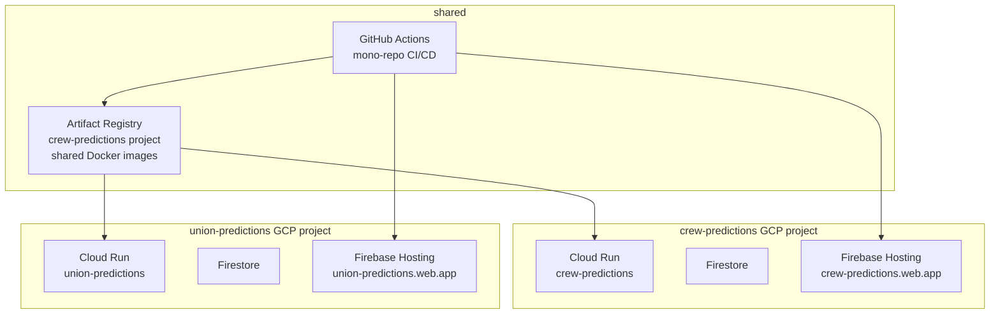
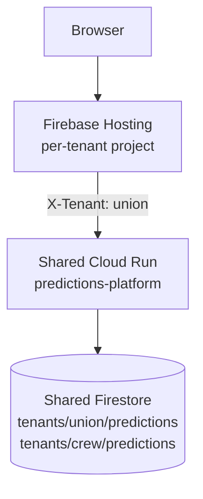

# White-Label Predictions — Design Considerations

This is a thinking artifact, not a roadmap. It captures the open decisions and tradeoffs for extending the crew-predictions codebase into a white-label platform for other MLS team podcasts. Nothing here is committed work.

**Out of scope:** An all-MLS predictions product would be a different codebase (likely all-TypeScript, different architecture). This doc only covers the white-label model — e.g. `union-predictions` as a separate deployment for Brotherly Game or similar.

---

## What White-Label Means Here

Each team podcast gets its own deployment: its own URL, its own branding, its own leaderboard, its own users. There is no cross-tenant leaderboard or shared user identity. `union-predictions` fans don't see `crew-predictions` data and vice versa.

---

## Deployment Model

### Option A — Fully Isolated GCP Projects (recommended lean)

Each tenant gets their own GCP project, Firebase project, Cloud Run service, Firestore database, and Firebase Hosting URL. This is the pattern already proven by the staging environment.



**Pros:**
- Zero blast radius between tenants — a broken deploy to Union doesn't touch Crew
- Each tenant has its own billing, its own quota, its own free tier
- Already know how to do this — staging is proof of concept

**Cons:**
- Operational surface multiplies with tenant count (N Cloud Run services, N Firebase projects, N billing killswitches)
- Standing up a new tenant requires manual GCP/Firebase setup steps before CI can take over

---

### Option B — Shared Cloud Run, Tenant Routing

One Cloud Run service handles all tenants. A `tenant` identifier (subdomain or header) routes requests to the right Firestore collection.



**Pros:** Cheaper, simpler infra to operate at scale.

**Cons:** One bad deploy affects all tenants. Data isolation requires careful Firestore security rules. Firebase Hosting still needs per-tenant projects (Hosting rewrites must be in the same GCP project as Cloud Run). Complicates the free tier — shared Firestore reads/writes count against one project's quota.

**Verdict:** Option A is the right call until there are enough tenants that the operational overhead becomes the actual problem. That's probably 10+ tenants.

---

## Codebase Strategy

### Option A — Mono-repo, shared core, per-tenant config

```
crew-predictions/          ← existing repo becomes the platform repo
├── cmd/server/            ← single binary, config-driven
├── internal/              ← shared logic
│   ├── espn/              ← abstracted to any ESPN team (not Columbus-specific)
│   ├── scoring/           ← format engines (shared)
│   ├── bot/               ← abstracted bot behavior
│   └── ...
├── tenants/
│   ├── crew/config.yaml   ← Crew-specific config
│   └── union/config.yaml  ← Union-specific config
├── src/                   ← Vue SPA, config-driven branding
└── .github/workflows/
    └── ci.yml             ← matrix or per-tenant deploy jobs
```

Bug fixes and new features flow to all tenants automatically. A breaking change in core affects all tenants simultaneously — the smoke suite per tenant is the safety net.

### Option B — Fork per tenant

`union-predictions` is a fork of `crew-predictions` at a point in time. Teams diverge independently.

**Verdict:** Mono-repo. Forks mean security fixes and scoring engine improvements don't propagate. The whole point of white-label is shared maintenance.

---

## What's Tenant-Specific (Config Surface)

```
ESPN team ID         → which team's matches to fetch from ESPN
Team name            → "Columbus Crew" / "Philadelphia Union"
Team colors          → CSS variables (gold + black → gold + blue)
Copy/tone            → sarcastic #Crew96 voice → different per podcast
Scoring formats      → which formats are enabled for this tenant
Bot behavior         → TwoOneBot predicts 2-1 Crew; Union bot predicts differently
Domain/URL           → crew-predictions.web.app / union-predictions.web.app
Firebase project IDs → per-tenant GCP/Firebase credentials
```

### Scoring: Format Selection vs. Rule Configuration

These are different complexity levels:

**Format selection** (simpler) — each tenant picks which of the fixed scoring engines to enable. Aces Radio, Upper 90, Grouchy™ are defined once in code; a tenant config says `formats: [aces_radio, upper_90]`. Union might not want Grouchy™.

**Rule configuration** (harder) — tenants can define custom point values or custom bucket logic. Opens the door to bugs in tenant config, harder to test, probably not needed for v1 of white-label.

**Lean:** Format selection only. New formats get added to the platform; tenants opt in.

---

## The ESPN Abstraction (Only Load-Bearing Code Change)

`internal/espn` currently hardcodes Columbus Crew filtering logic. This is the one place where "Crew" is in the business logic, not just in copy. Everything else is configuration.

The abstraction is straightforward — parameterize the team identifier — but it's the prerequisite for any white-label work. Until this is done, the codebase can't be deployed for another team.

```
Current:  fetchCrewMatchesFrom(base) → filters ESPN results for Columbus Crew
Target:   fetchTeamMatchesFrom(base, teamID) → filters for any ESPN team ID
```

ESPN team IDs are stable identifiers available from the same scoreboard endpoints already used.

---

## Auth Model

**Open question: does each tenant have its own Firebase Auth project?**

With fully isolated GCP projects (Option A), each tenant gets their own Firebase Auth. A user who wants to predict for both Crew and Union would need two accounts. This is probably fine — these are different communities.

A shared auth layer (one Firebase Auth project, credentials accepted by all tenants) would allow single sign-on across tenants but adds complexity and couples the auth infrastructure. Not worth it unless a "predict across teams" feature becomes a goal.

**Lean:** Isolated Firebase Auth per tenant. Simpler, no cross-tenant identity concerns.

---

## Bot Behavior

TwoOneBot predicts Columbus 2-1 (home) / 1-2 (away) on every match. The bot is a personality, not just a fixture.

For a Union tenant, the bot would predict Union's "signature" scoreline — whatever the podcast community finds funny. This is config (team name, home/away predictions) but also copy (the bot's handle and personality).

The bot abstraction is simpler than the ESPN abstraction — it's just a config struct.

---

## Domain Strategy

Three options per tenant:

| Option | Example | Notes |
|---|---|---|
| `.web.app` subdomain | `union-predictions.web.app` | Free, no DNS setup, looks amateur |
| Custom subdomain | `predictions.brotherlygame.com` | Tenant brings their own domain; Firebase Hosting supports custom domains |
| Platform subdomain | `union.predictions.crew96.com` | Requires the platform owner to hold a domain |

**Lean:** Tenants bring their own custom domain if they want one; `.web.app` is the default. No platform domain needed yet.

---

## Onboarding Cost (The Real Product Question)

Standing up a new tenant today would require:

1. Create GCP project + Firebase project (manual Console steps)
2. Enable Firestore, Firebase Auth, Firebase Hosting, Artifact Registry
3. Configure OAuth client for Google SSO
4. Add GitHub Actions secrets for the new tenant
5. Add tenant config to mono-repo
6. Add CI deploy job for the new tenant
7. Set up billing killswitch for the new project

Steps 1–3 are manual GCP console work that can't easily be scripted without Terraform. This is the actual friction. The rest is config.

If white-label becomes real, a Terraform module per tenant (or a `create-tenant.sh` script) is the investment that makes onboarding tractable.

---

## Billing at Scale

Each GCP project gets its own free tier (Cloud Run: 2M req/mo, Firestore: 50k reads/20k writes/day). For small podcast communities this is plenty — each tenant stays free indefinitely.

The billing killswitch (`infra/billing-killswitch/`) would need to be deployed per tenant project. The same Cloud Function code works; it just needs to be pointed at the right project IDs.

---

## Cross-Tenant Features — Explicit No (for now)

- No national leaderboard across tenants
- No shared user identity
- No cross-tenant match data
- No "predict for all your teams in one place"

These are all possible future directions but none of them are white-label — they're the all-MLS product (different codebase, different conversation).

---

## Tenant Exit / Data Portability

If a podcast community wants to leave or self-host, they should be able to take their data. Firestore export to JSON is straightforward via `gcloud firestore export`. The Docker image is already in Artifact Registry. A departing tenant could stand up their own GCP project and import their data.

This is worth designing for even if it never happens — it's good discipline and good faith.

---

## Open Decisions

| Decision | Status | Blocking |
|---|---|---|
| Isolated vs. shared GCP projects | Leaning isolated | Nothing yet |
| Mono-repo vs. fork | Leaning mono-repo | Nothing yet |
| Format selection vs. rule configuration | Leaning selection only | Nothing yet |
| Shared vs. isolated Firebase Auth | Leaning isolated | Nothing yet |
| Domain strategy | `.web.app` default, custom optional | Nothing yet |
| Terraform / tenant onboarding script | Open | Real work; not needed until first tenant |
| First tenant (who?) | Open | The whole thing |
